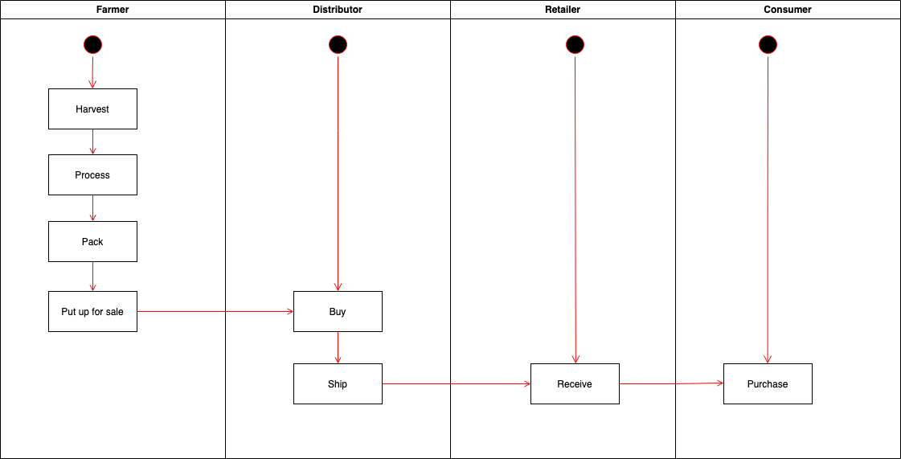
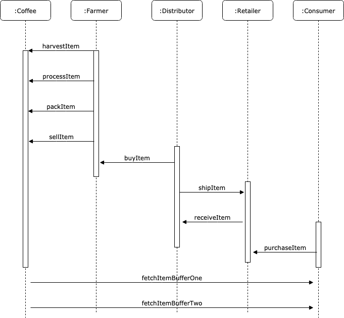
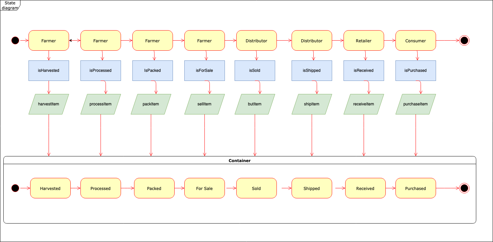

The contracts have been developed, tests have been created, the flow has been first tested with ganache, after it was deployed to rinkeby,
the contract address is https://rinkeby.etherscan.io/address/0x6ea1c8aaa4a9c5555570d9bf25490bd665042351#code

ULM diagrams:

