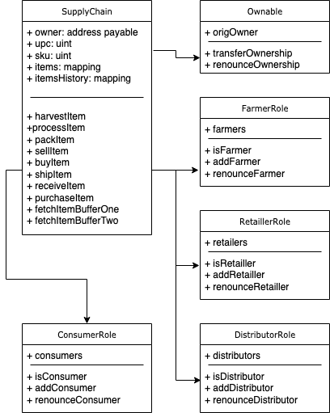

# Development/testing/deployment
The contracts have been developed, tests have been created, the flow has been first tested with ganache, after it was deployed to rinkeby,
the contract address is https://rinkeby.etherscan.io/address/0x6ea1c8aaa4a9c5555570d9bf25490bd665042351#code
## Libraries
The libraries used are as defined in package.json. I had to use an older version of web3, with the latest I was running into issues. For solidity, I used the latest.
I had issues as well with the boilerplate code, but was able to address them.

# ULM diagrams:

## Activity diagram

## Sequence diagram

## State diagram

## Class diagram

